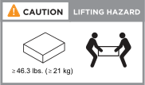

= AI Data Engineのデータコンピューティングノードのインストール要件
:allow-uri-read: 
:icons: font
:imagesdir: ../media/

[role="lead"]
AI Data Engineのデータ計算ノードに必要な機器と持ち上げる際の注意事項を確認してください。

== 前提条件

AIDE のデータ計算ノードをインストールする前に、以下の点を確認してください：

* AFX 1K ストレージ システム。
+

NOTE: AFX 1Kストレージシステムのインストールについては、link:https://docs.netapp.com/us-en/ontap-afx/install-setup/install-setup-workflow.html["AFX 1Kストレージシステムをインストールする"^]を参照してください。

== インストールに必要な機器

AIDE のデータ計算ノードをインストールするには、以下の機材とツールが必要です。

* データコンピューティングノードを構成するための Web ブラウザへのアクセス
* 静電気放電（ESD）ストラップ
* 懐中電灯
* USB/シリアル接続を備えたラップトップまたはコンソール
* No.2プラス ドライバ

== 持ち上げ時の注意事項

データ計算ノードは重いです。これらの品物を持ち上げたり移動したりするときには注意してください。

=== データ計算ノードの重み

データコンピューティングノードを移動または持ち上げる場合は、必要な予防措置を講じてください。

データ コンピューティング ノードの重量は最大 46.3 lbs（21Kg）になります。データ コンピューティング ノードを持ち上げるには、2 人または油圧リフトを使用します。

.関連情報
* https://library.netapp.com/ecm/ecm_download_file/ECMP12475945["安全情報と規制に関する通知"^]

.次の手順
ハードウェア要件を確認したら、link:prepare-hardware.html["データコンピューティングノードのインストールの準備"]。
