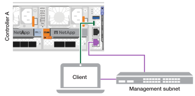

= AI Data Engineのデータ計算ノードの電源をオンにします
:allow-uri-read: 
:icons: font
:imagesdir: ../media/

[role="lead"]
ラック ハードウェアをインストールし、データ コンピューティング ノードをケーブル接続した後、まだ電源がオンになっていない場合は、DCN と AFX ストレージ システムのコントローラー ノードの電源をオンにする必要があります。

.開始する前に
* 棚の電源がオンになっており、各棚に固有の棚 ID が割り当てられていることを確認します。AFX ストレージシステムのシェルフ ID の割り当てについては、link:https://docs.netapp.com/us-en/ontap-afx/install-setup/power-on-hardware.html#step-1-power-on-the-shelf-and-assign-shelf-id["固有の棚IDを割り当てる"^]を参照してください。

.手順
ストレージシェルフの電源をオンにして一意の ID を割り当てた後、DCN の電源をオンにし、ストレージコントローラノードの電源をオンにします（まだオンになっていない場合）。

. ラップトップをシリアルコンソールポートに接続します。これにより、コントローラの電源がオンになったときのブートシーケンスを監視できます。
+
.. ラップトップのシリアルコンソールポートを115,200ボー、N-8-1に設定します。
+
シリアル コンソール ポートの設定方法については、ラップトップのオンライン ヘルプを参照してください。

.. コンソール ケーブルをラップトップに接続し、ストレージ システムに付属のコンソール ケーブルを使用してコントローラのシリアル コンソール ポートに接続します。
.. ラップトップを管理サブネット上のスイッチに接続します。
+

. 管理サブネット上のアドレスを使用して、ラップトップに TCP/IP アドレスを割り当てます。
. 電源コードをコントローラーの電源に差し込み、別の回路の電源に接続します。
+
image::../media/drw_affa1k_power_source_icon_ieops-1700.svg[電源接続図]

+
** システムの起動が始まります。最初の起動には最大8分かかる場合があります。
** LED が点滅し、ファンが始動します。これは、コントローラーの電源がオンになっていることを示しています。
** 起動時にファンの騒音が大きくなる場合がありますが、これは正常です。

. 電源コードをデータコンピューティングノードの電源に差し込み、別の回路の電源に接続します。
. 各電源装置の固定装置を使用して電源コードを固定します。
. データコンピューティングノードの電源をオンにします。
+
電源スイッチにアクセスするには、ベゼルを取り外す必要がある場合があります。その場合は、後で必ず再度取り付けてください。

.次の手順
データコンピューティングノードをオンにしたら、link:../install-setup/cluster-setup-afx.html["ONTAP AIDEクラスタをセットアップする"]。
